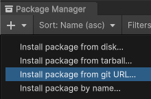
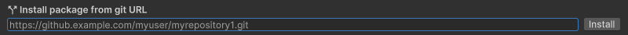

# Unity-Extensions

Unity 엔진의 기본 기능을 확장하기 위한 다양한 유틸리티와 도구를 제공합니다. 개발자들이 더 효율적으로 작업할 수 있도록 설계되었으며, 커스터마이징 가능한 기능과 쉽게 통합할 수 있는 패키지로 구성되어 있습니다.

## 요구사항

- Unity 2021.3 이상
- .NET Standard 2.1

## 개요

이 패키지는 Unity의 기본 기능을 확장하는 다양한 클래스와 메서드를 제공합니다. 주요 기능은 다음과 같습니다:

- **Vector2Extensions**: `Vector2` 구조체에 대한 확장 메서드를 제공합니다. 좌표 변환, 회전, 거리 계산, 보간 등 다양한 기능을 제공합니다.
- **Vector3Extensions**: `Vector3` 구조체에 대한 확장 메서드를 제공합니다. 좌표 변환, 회전, 거리 계산, 사영, 반사, 보간 등 다양한 기능을 제공합니다.
- **Vector4Extensions**: `Vector4` 구조체에 대한 확장 메서드를 제공합니다. 좌표 변환, 거리 계산, 보간 등 다양한 기능을 제공합니다.
- **Vector2IntExtensions**: `Vector2Int` 구조체에 대한 확장 메서드를 제공합니다. 좌표 변환, 거리 계산 등 다양한 기능을 제공합니다.
- **Vector3IntExtensions**: `Vector3Int` 구조체에 대한 확장 메서드를 제공합니다. 좌표 변환, 거리 계산 등 다양한 기능을 제공합니다.
- **ColorExtensions**: `Color` 구조체에 대한 확장 메서드를 제공합니다. 색상 변환, 보간 등 다양한 기능을 제공합니다.
- **Color32Extensions**: `Color32` 구조체에 대한 확장 메서드를 제공합니다. 색상 변환, 보간 등 다양한 기능을 제공합니다.
- **FloatExtensions**: `float` 타입에 대한 확장 메서드를 제공합니다. 근사 비교, 범위 매핑, 부호 변경 등 다양한 기능을 제공합니다.
- **DoubleExtensions**: `double` 타입에 대한 확장 메서드를 제공합니다. 근사 비교, 범위 매핑, 부호 변경 등 `FloatExtensions`와 유사한 기능을 제공합니다.
- **ComponentExtensions**: `Component` 클래스에 대한 확장 메서드를 제공합니다. 컴포넌트를 가져오거나 추가하고, 자식 또는 부모에서 컴포넌트를 검색하는 기능을 제공합니다.
- **CameraExtensions**: `Camera` 클래스에 대한 확장 메서드를 제공합니다. 배경색 설정, 렌즈 쉬프트, 픽셀 사각형 설정 등 다양한 기능을 제공합니다.
- **CanvasScalerExtensions**: `CanvasScaler` 클래스에 대한 확장 메서드를 제공합니다. `ScaleWithScreenSize` 모드에서 계산된 스케일 팩터를 가져오는 기능을 제공합니다.
- **GameObjectExtensions**: `GameObject` 클래스에 대한 확장 메서드를 제공합니다. 컴포넌트를 가져오거나 추가하고, 자식 또는 부모에서 컴포넌트를 검색하고, 레이어 설정 등 다양한 기능을 제공합니다.
- **GraphicExtensions**: `Graphic` 클래스에 대한 확장 메서드를 제공합니다. 색상 채널 값을 설정하는 기능을 제공합니다.
- **IComparableExtensions**: `IComparable` 인터페이스에 대한 확장 메서드를 제공합니다. 값이 지정된 간격 내에 있는지 확인하는 기능을 제공합니다.
- **IEnumerableExtensions**: `IEnumerable` 인터페이스에 대한 확장 메서드를 제공합니다. 임의의 요소 가져오기, 임의의 요소들 가져오기 기능을 제공합니다.
- **IEquatableExtensions**: `IEquatable` 인터페이스에 대한 확장 메서드를 제공합니다. 값이 지정된 배열의 모든 요소와 같은지 확인하고, 지정된 배열의 요소 중 하나 이상과 같은지 확인하는 기능을 제공합니다.
- **IListExtensions**: `IList` 인터페이스에 대한 확장 메서드를 제공합니다. 인덱스에 있는 요소를 꺼내고, 인덱스들에 있는 요소들을 꺼내는 기능을 제공합니다.
- **ObjectExtensions**: `Object` 클래스에 대한 확장 메서드를 제공합니다. 객체가 지정된 배열의 모든 요소와 같은지 확인하고, 지정된 배열의 요소 중 하나 이상과 같은지 확인하는 기능을 제공합니다.
- **QuaternionExtensions**: `Quaternion` 구조체에 대한 확장 메서드를 제공합니다. 축에 값을 설정하는 기능을 제공합니다.
- **RayExtensions**: `Ray` 구조체에 대한 확장 메서드를 제공합니다. 반전된 Ray 생성, 임의로 Ray 방향을 편향시키는 기능을 제공합니다.
- **RectExtensions**: `Rect` 구조체에 대한 확장 메서드를 제공합니다. 중심, 위치, 높이, 너비 설정 기능을 제공합니다.
- **RectTransformExtensions**: `RectTransform` 클래스에 대한 확장 메서드를 제공합니다. 크기 델타 x, y 설정, 앵커 최소 x, y 설정, 앵커 최대 x, y 설정, 앵커 중심 x, y 설정, 앵커 피봇 x, y 설정, 앵커 피봇 최소 x, y 설정, 앵커 피봇 최대 x, y 설정, 앵커 피봇 최소 x, y 설정, 앵커 피봇 최대 x, y 설정 기능을 제공합니다.
- **RenderTextureExtensions**: `RenderTexture` 클래스에 대한 확장 메서드를 제공합니다. 텍스처 생성, 텍스처 쓰기, 스프라이트 생성 기능을 제공합니다.
- **SceneExtensions**: `Scene` 클래스에 대한 확장 메서드를 제공합니다. Scene에서 컴포넌트를 가진 게임 오브젝트를 찾고, Scene에서 컴포넌트를 가진 게임 오브젝트들을 찾는 기능을 제공합니다.
- **TransformExtensions**: `Transform` 클래스에 대한 확장 메서드를 제공합니다. 모든 자식 가져오기, 임의의 자식 가져오기, 자식 추가, 모든 자식 제거, 첫 번째 자식 제거, 마지막 자식 제거, Transform을 RectTransform 타입으로 캐스팅 기능을 제공합니다.
- **LayerMaskExtensions**: `LayerMask` 클래스에 대한 확장 메서드를 제공합니다. 레이어 마스크에서 레이어 제거, 레이어 마스크에서 레이어 제거 기능을 제공합니다.
- **DateTimeExtensions**: `DateTime` 클래스에 대한 확장 메서드를 제공합니다. 날짜 비교, 날짜 범위 매핑, 날짜 범위 검사 기능을 제공합니다.
- **IEnumeratorExtensions**: `IEnumerator` 인터페이스에 대한 확장 메서드를 제공합니다. `IEnumerator` 를 `IEnumerable` 로 변환하는 기능을 제공합니다.
- **IEnumerableExtensions**: `IEnumerable` 인터페이스에 대한 확장 메서드를 제공합니다. 시퀀스의 각 요소에 대해 지정된 동작을 수행하는 기능을 제공합니다.
- **AsyncOperationExtensions**: `AsyncOperation` 클래스에 대한 확장 메서드를 제공합니다. `AsyncOperation`을 `Task`로 변환하는 기능을 제공합니다.
- **TaskExtensions**: `Task` 클래스에 대한 확장 메서드를 제공합니다. `Task`에 취소 토큰을 적용하는 기능을 제공합니다.
- **LocaleExtensions**: `Locale` 클래스에 대한 확장 메서드를 제공합니다. `Locale`을 가져오고, 설정하고, 문자열로 변환하는 기능을 제공합니다. `UNITY_LOCALIZATION_AVAILABLE` 전처리기가 정의되어 있을 때만 사용할 수 있습니다.

## 설치 방법

### UPM을 통한 설치 (Git URL 사용)

#### 선행 조건

- Git 클라이언트(최소 버전 2.14.0)가 설치되어 있어야 합니다.
- Windows 사용자의 경우 `PATH` 시스템 환경 변수에 Git 실행 파일 경로가 추가되어 있어야 합니다.

#### 설치 방법 1: Package Manager UI 사용

1. Unity 에디터에서 Window > Package Manager를 엽니다.
2. 좌측 상단의 + 버튼을 클릭하고 "Add package from git URL"을 선택합니다.

   
3. 다음 URL을 입력합니다:

```text
https://github.com/creator-hian/Unity-Extensions.git
```

4. 'Add' 버튼을 클릭합니다.

   

#### 설치 방법 2: manifest.json 직접 수정

1. Unity 프로젝트의 `Packages/manifest.json` 파일을 열어 다음과 같이 dependencies 블록에 패키지를 추가하세요:

```json
{
  "dependencies": {
    "com.creator-hian.unity.extensions": "https://github.com/creator-hian/Unity-Extensions.git",
    ...
  }
}
```

#### 특정 버전 설치

특정 버전을 설치하려면 URL 끝에 #{version} 을 추가하세요:

```json
{
  "dependencies": {
    "com.creator-hian.unity.extensions": "https://github.com/creator-hian/Unity-Extensions.git#0.4.0"
    ...
  }
}
```

#### 참조 문서

- [Unity 공식 매뉴얼 - Git URL을 통한 패키지 설치](https://docs.unity3d.com/kr/2023.2/Manual/upm-ui-giturl.html)

## 문서

각 기능에 대한 자세한 설명은 해당 기능의 README를 참조하세요:

## 원작성자

- [Hian](https://github.com/creator-hian)

## 기여자

## 라이센스

[라이센스 정보 추가 필요]
